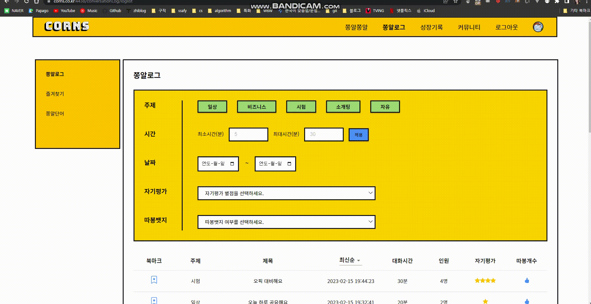
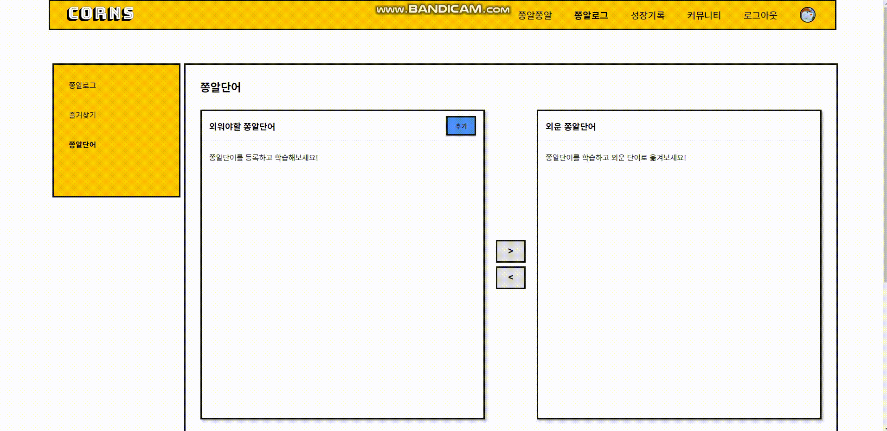
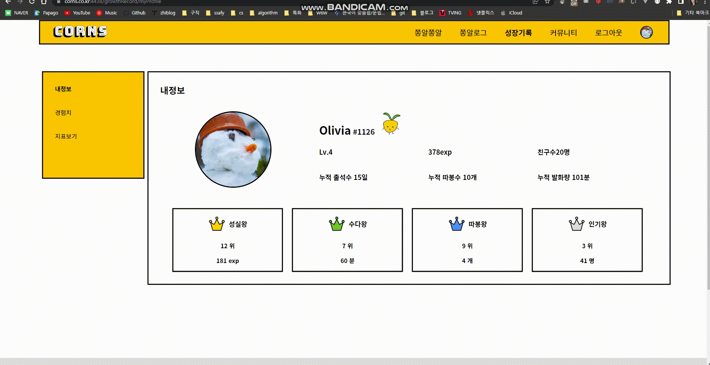
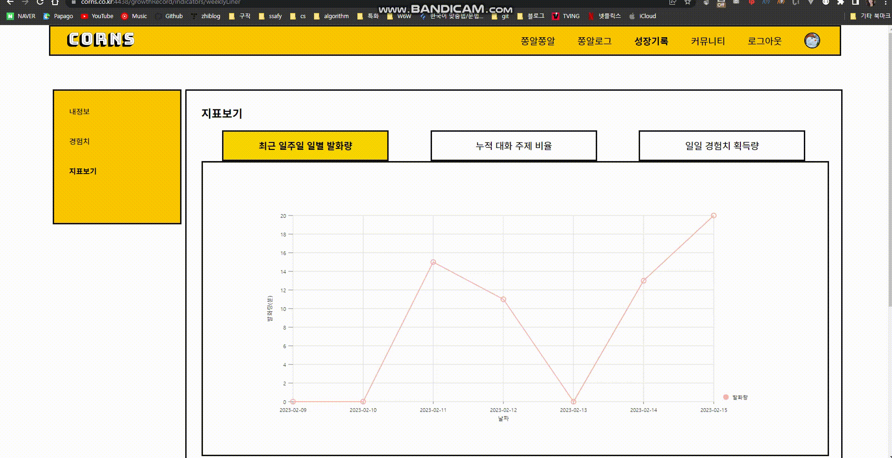
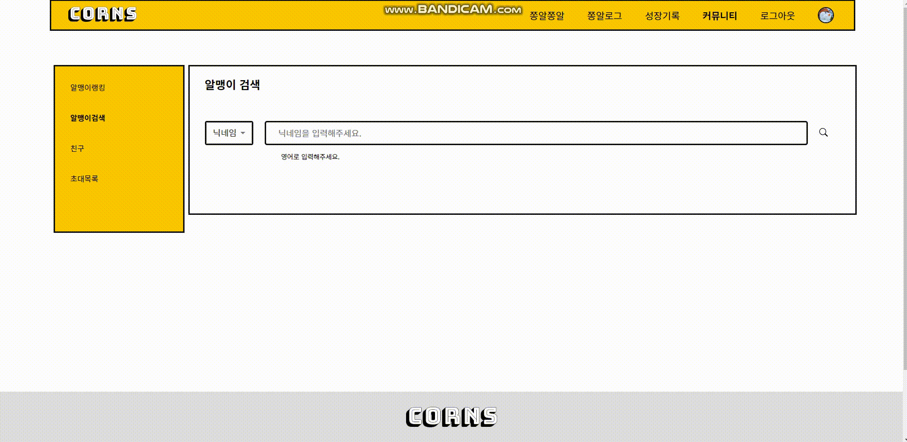
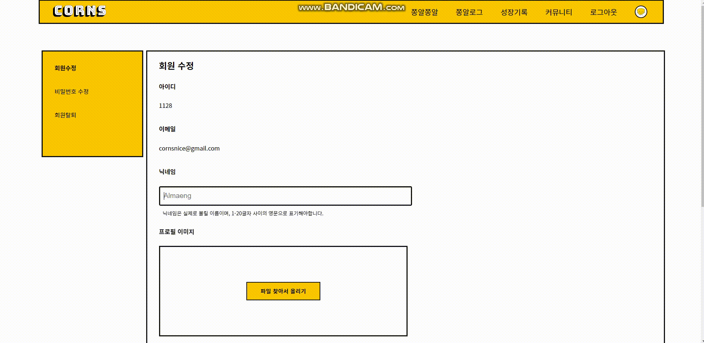
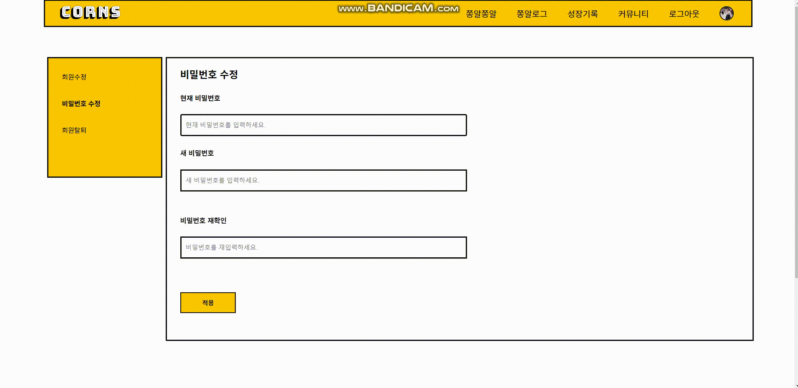
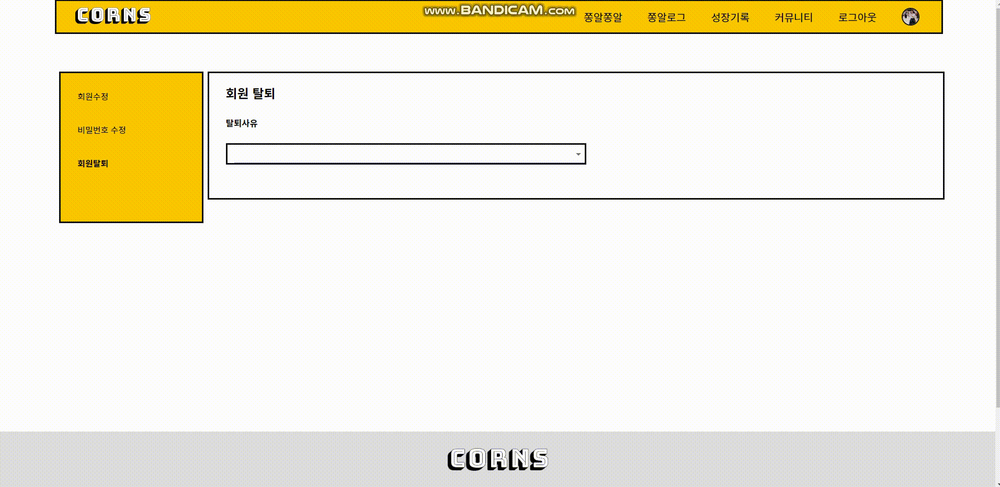

# 🌽 CORNS - 스크립트와 지표를 통해 실력 향상을 확인하면서 공부하는 화상 영어 회화


## 💛 배경 및 개요

여러분들은 영어 회화 공부를 하면서 쉽게 포기해본 경험이 있나요? '내 실력이 정말 향상되고 있는 걸까?', '나와 비슷한 사람들과 함께 공부하고 싶다'라는 생각이 들곤 합니다.

CORNS는 그러한 니즈를 충족하기 위해 탄생한 회상 영어 회화 서비스입니다. 대화 기록을 남기고 실력 향상 지표와 스크립트를 통해 강력한! 동기부여를 받을 수 있습니다.

### 프로젝트 진행 기간

2023.01.03(화) ~ 2023.02.17(금)

---

## 💛 주요 기능

[핵심 컨셉] 옥수수 **알맹이**들이 **쫑알쫑알** 영어 대화를 나눠 성장하는 화상 영어회화 서비스

### 🌽 쫑알쫑알

- 레벨, 경험치 정보를 캐릭터와 상태바를 통해 확인할 수 있어요. 동기부여 포인트 !
- 원하는 대화 주제를 선정하고, 제목, 시간 인원을 설정하여 대화방을 생성할 수 있어요.
- 쫑알룸 리스트를 원하는 필터로 검색할 수 있어요.
- 친구를 `초대`해서 함께 대화할 수 있어요.
- 대화 도중 번역이 필요할 때 한->영, 영->한 `번역기`를 사용할 수 있어요.
- 모르는 `단어`를 쫑알단어에 `추가`할 수 있어요.
- 대화가 종료되면 `따봉투표`를 통해 가장 잘한 멤버를 뽑을 수 있어요.

### 🌽 쫑알로그

- 쫑알로그를 통해 대화 `스크립트`를 보고 다운받을 수 있어요.
- `자기평가`를 통해 대화별 별점과 한줄평을 남길 수 있어요.
- 주제, 시간, 날짜, 자기평가, 따봉뱃지로 필터링해서 쫑알로그를 검색할 수 있어요.
- 다시보고 싶은 대화는 `즐겨찾기`로 모아볼 수 있어요.
- `쫑알단어`를 통해 `나만의 단어장`을 만들고 학습할 수 있어요.

### 🌽 성장기록

- 레벨, 경험치, 친구수, 누적 출석/따봉/발화량을 확인할 수 있어요.
- 각 랭킹의 나의 등수를 확인할 수 있어요.
- 경험치 내역을 확인할 수 있어요.
- 지표를 통해 나의 학습 상태를 확인하고 동기부여 받을 수 있어요.
- 지표
  - `[최근 일주일 일별 발화량]` 나의 발화량을 그래프로 확인할 수 있어요.
  - `[대화 주제 비율]` 누적 대화 주제 비율을 확인할 수 있어요.
  - `[일일 경험치 획득량]` 2주간 데이터를 비교하여 지난주 대비 이번주의 활동량을 확인할 수 있어요.

### 🌽 커뮤니티

- 알맹이랭킹
  - [성실왕] 최근 일주일 간 `누적 경험치`가 많은 순으로 랭킹이 부여돼요.
  - [수다왕] 최근 일주일 간 `누적 발화량`이 많은 순으로 랭킹이 부여돼요.
  - [따봉왕] 최근 일주일 간 `누적 따봉뱃지`가 많은 순으로 랭킹이 부여돼요.
  - [인기왕] 최근 일주일 간 `누적 친구 신청수`가 많은 순으로 랭킹이 부여돼요.
- 닉네임, 아이디로 알맹이검색을 할 수 있어요.
- 친구 신청 목록에서 메시지를 확인하고 수락 또는 거절할 수 있어요.
- 친구 목록을 볼 수 있고 닉네임, 아이디로 검색할 수 있어요.
- 쫑알룸 `초대목록`을 확인할 수 있어요.

---

## 💻 주요 기술

### Backend

- IntelliJ IDE
- Spring boot v2.7.7
- Spring Data JPA
- Spring Web
- QueryDSL
- Swagger v3.0
- Lombok
- MySQL

#### package 구조

```
com.w6w.corns
  ├── config
  ├── controller
  ├── domain
  │   ├── entity
  │   └── repository
  ├── domain
  │   └── simple
  ├── dto
  ├── service
  └── util
```

### Frontend

- Visual Studio Code IDE
- node v16.13.2 (LTS)
- React v18.2.0 (LTS)
- axios v1.3.0
- redux v4.2.1
- redux-toolkit v1.9.2
- Naver Papago API

### WebRTC

- OpenVidu v2.25

### CI/CD

- AWS EC2
- Jenkins
- Nginx
- SSL

---

## 💻 협업

- Git-flow
- Notion
- JIRA
- MatterMost
- Webex

---

### 협업 환경

- Git
  - Merge Request를 통한 코드 리뷰
  - Git-flow 도입
- Notion
  - 오전 스크럼 미팅 회의록 작성 및 문서화
- JIRA
  - 매주 월요일 백로그 작성 후 스프린트 생성
  - 업무의 할당량을 정해 Story Point 설정
  - In-Progress -> Done 순으로 작업
- MatterMost
  - Archiving, Scrum, Bot channel을 통해 소통
- Webex
  - 온라인 업무 시 화상 회의 진행

### 역할 분배

| 역할      | 상세                          | 담당자                                         |
| --------- | ----------------------------- | ---------------------------------------------- |
| 팀장      |                               | 인수경                                         |
| 부팀장    |                               | 김재희                                         |
| 서기      |                               | 이하림                                         |
| 기술 고문 |                               | 박홍빈                                         |
| 일정 관리 | Frontend                      | 류하은                                         |
|           | Backend                       | 변지윤                                         |
| Frontend  | UX/UI                         | 인수경, 류하은, 박홍빈, 김재희                 |
| Backend   | 기능 구현, DB modeling        | 변지윤, 이하림, 박홍빈, 김재희                 |
|           | CI/CD                         | 박홍빈                                         |
| 공통 업무 | 자료 조사, 아이디어, PPT, UCC | 인수경, 류하은, 박홍빈, 김재희, 변지윤, 이하림 |

---

## 💻 프로젝트 산출물

- [회의록](https://zhilogs.notion.site/W6W-2d2f00a857d54105a1c079c08439b69a)
- [컨벤션](https://zhilogs.notion.site/540cb8f21b474743b1c0925584538b67)
- [IA](./src/ia.png)
- [WBS](https://docs.google.com/spreadsheets/d/1bioYl9ew_S9c9JJHP2FEnGKV43hS11z-UsIPmI8eZFM/edit#gid=438224077)
- [목업디자인](https://www.figma.com/file/aGXa737bSDqDJHShqLEctZ/%ED%95%B4%EC%BB%A4%ED%86%A4?node-id=382%3A1751&t=sU3iVB7GiWPuY76v-1)
- [기능명세](https://zhilogs.notion.site/764b2e39eac84c428b2762838aef1370?v=2c08e662f5274e67aa170abac3c34772)
- [ERD](./src/erd.png)
- [API 명세](https://zhilogs.notion.site/2654f0708fc6488a8f6859a4daf15307?v=3cf24eae71544232b9b191fe8ca39549)
- [QA](https://zhilogs.notion.site/wish-83521e9c3bef4d19b6c63def5caf3baa)
- [중간발표자료](./src/0127.pdf)
- 최종발표자료

---

## 💛 서비스 화면

### 🌽 메인


#### 로그인 & 회원가입


### 🌽 쫑알쫑알

- 초대를 받고 쫑알룸으로 이동해요
  
- 번역기와 단어장을 사용할 수 있어요
  
- 따봉 투표를 해요
  

### 🌽 쫑알로그


#### 즐겨찾기



#### 쫑알단어



### 🌽 성장기록

#### 내정보



#### 경험치


#### 지표보기



### 🌽 커뮤니티

#### 알맹이랭킹


#### 알맹이검색



#### 친구


### 🌽 마이페이지

#### 회원 수정



#### 비밀번호 수정



#### 회원탈퇴


