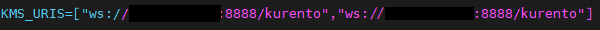
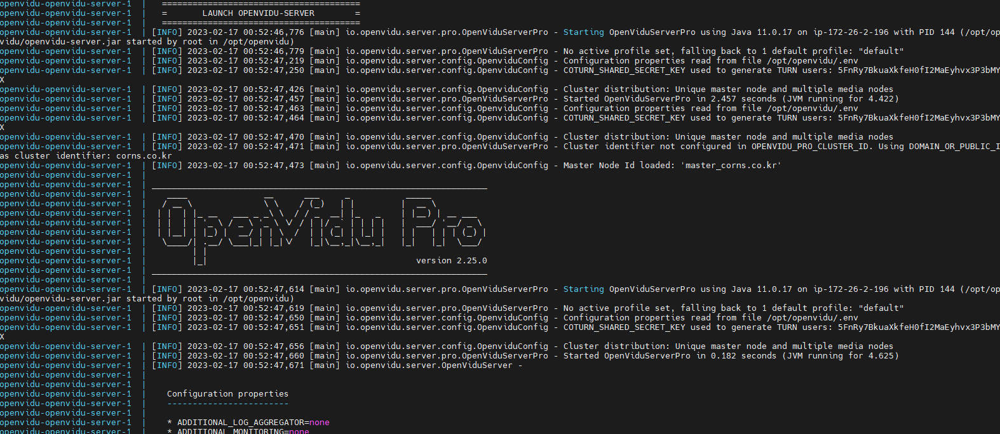

# 🌽 OpenVidu 배포 가이드

참고 사이트 :

[OpenVidu Pro on-premises 공식 문서](https://docs.openvidu.io/en/stable/deployment/pro/on-premises/)

## 미디어 서버

<aside>
💡 stt 사용시 **2 CPU / 8GB of RAM** 이상 스펙의 서버 필요

</aside>

### 포트 오픈

<aside>
📌 ufw allow ssh
ufw allow 40000:65535/tcp
ufw allow 40000:65535/udp
ufw allow 3000/tcp from <OPENVIDU_SERVER_PRO_IP>
ufw allow 4000/tcp from <OPENVIDU_SERVER_PRO_IP>
ufw allow 8888/tcp from <OPENVIDU_SERVER_PRO_IP>
ufw allow 80/tcp from <OPENVIDU_SERVER_PRO_IP>
ufw enable

</aside>

### 도커 설치

```kotlin
-- apt 업데이트, 패키지 설치
sudo apt-get update
sudo apt-get install \
    apt-transport-https \
    ca-certificates \
    curl \
    gnupg-agent \
    software-properties-common

-- GPG key 등록
curl -fsSL https://download.docker.com/linux/ubuntu/gpg | sudo apt-key add -

-- repository에 추가
sudo add-apt-repository \
    "deb [arch=amd64] https://download.docker.com/linux/ubuntu \
    $(lsb_release -cs) \
    stable"

-- docker 설치하기
sudo apt-get update
sudo apt-get install docker-ce docker-ce-cli containerd.io

-- ubuntu image 받기
docker pull ubuntu

-- image 실행
docker run -it ubuntu

-- Docker compose 설치
sudo curl -L "https://github.com/docker/compose/releases/download/v2.12.2/docker-compose-$(uname -s)-$(uname -m)"  -o /usr/local/bin/docker-compose
sudo mv /usr/local/bin/docker-compose /usr/bin/docker-compose
sudo chmod +x /usr/bin/docker-compose
```

### 배포

```c
sudo su
cd /opt
curl https://s3-eu-west-1.amazonaws.com/aws.openvidu.io/install_media_node_latest.sh | bash
```

### 시작

````kotlin
./media_node start      -- 시작
./media_node restart    -- 재시작
    ```

## 마스터 서버

### 포트 오픈

<aside>
📌 ufw allow ssh
ufw allow 80/tcp
ufw allow 443/tcp
ufw allow 3478/tcp
ufw allow 3478/udp
ufw allow 5044/tcp
ufw allow 9200/tcp
ufw allow 40000:65535/tcp
ufw allow 40000:65535/udp
ufw enable

</aside>

### 도커 설치

```kotlin
-- apt 업데이트, 패키지 설치
sudo apt-get update
sudo apt-get install \
    apt-transport-https \
    ca-certificates \
    curl \
    gnupg-agent \
    software-properties-common

-- GPG key 등록
curl -fsSL https://download.docker.com/linux/ubuntu/gpg | sudo apt-key add -

-- repository에 추가
sudo add-apt-repository \
    "deb [arch=amd64] https://download.docker.com/linux/ubuntu \
    $(lsb_release -cs) \
    stable"

-- docker 설치하기
sudo apt-get update
sudo apt-get install docker-ce docker-ce-cli containerd.io

-- ubuntu image 받기
docker pull ubuntu

-- image 실행
docker run -it ubuntu

-- Docker compose 설치
sudo curl -L "https://github.com/docker/compose/releases/download/v2.12.2/docker-compose-$(uname -s)-$(uname -m)"  -o /usr/local/bin/docker-compose
sudo mv /usr/local/bin/docker-compose /usr/bin/docker-compose
sudo chmod +x /usr/bin/docker-compose
````

### 도커파일 받기

```kotlin
sudo su
cd /opt
curl https://s3-eu-west-1.amazonaws.com/aws.openvidu.io/install_openvidu_pro_latest.sh | bash
```

### 환경변수 설정

```kotlin
cd /opt/openvidu
nano .env
```

### 필수설정

- **`DOMAIN_OR_PUBLIC_IP`**  : 마스터서버 도메인 or public ip 주소
- **`OPENVIDU_SECRET`** : api 호출시 사용할 비밀번호
- **`ELASTICSEARCH_PASSWORD`** : 모니터링 서비스 비밀번호
- **`OPENVIDU_PRO_LICENSE`** : PRO버전 라이센스키
- **`CERTIFICATE_TYPE`** : 암호화방식
- **`KMS_URIS` : 미디어 노드 public ip:8888/kurento**



### 마스터 서버 실행

```kotlin
sudo su
cd /opt/openvidu
./openvidu start
```


